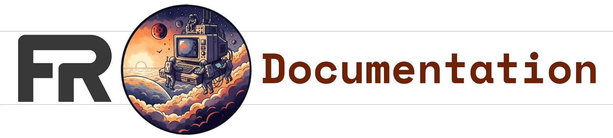

## Machine-Readable

FedRAMP Machine-Readable (FRMR) requirements, recommendations, definitions, and key security indicators for FedRAMP 20x and FedRAMP Rev5 Balance Improvement Releases are available in this repository. These materials are the authoritative source of truth for FedRAMP processes. 

Stakeholders are **strongly encouraged** to directly integrate FRMR docs with their GRC engineering and automation systems as this is the most effective way to always have the latest version with additional enrichment.

| Available Materials | Description |
| -- | -- |
| [FRMR.documentation.json](FRMR.documentation.json) | This file contains core FedRAMP 20x requirements, recommendations, definitions, and key security indicators. Each process in this file also includes applicability (including to Rev5) and additional metadata like update history. |
| [FRMR.md](FRMR.md) | Additional information on the structure of the FRMR docs. |

---

### [Go to fedramp.gov/docs](https://fedramp.gov/docs) for a human-readable web version of these docs.

---

Other content in this repository includes traditional FedRAMP documentation in enriched markdown and the [related scaffolding](tools/README.md) to develop and build the static documentation site.